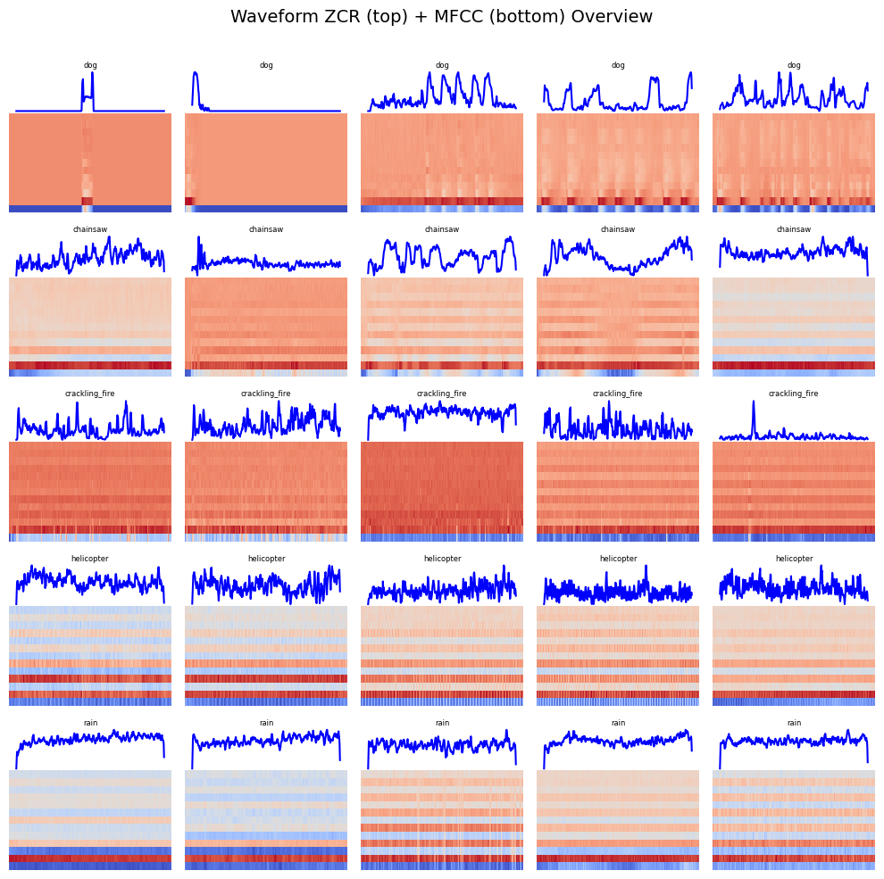
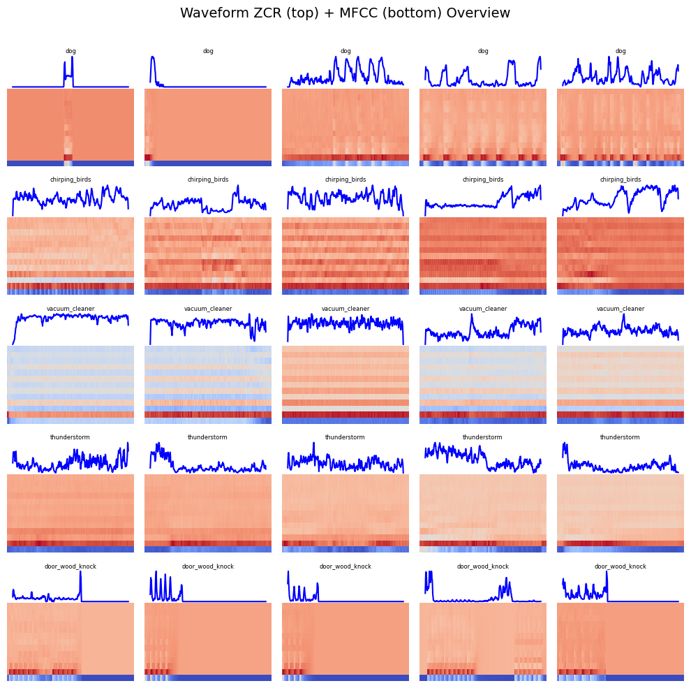
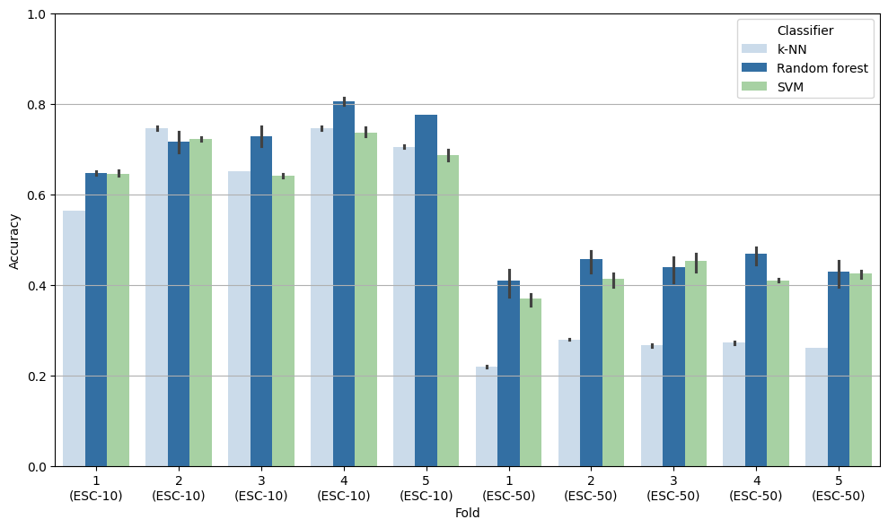
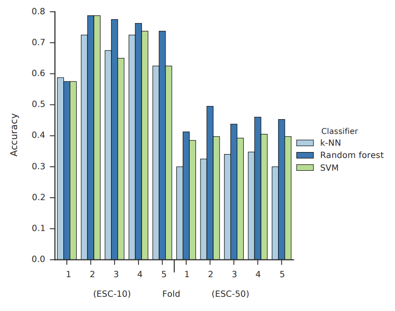
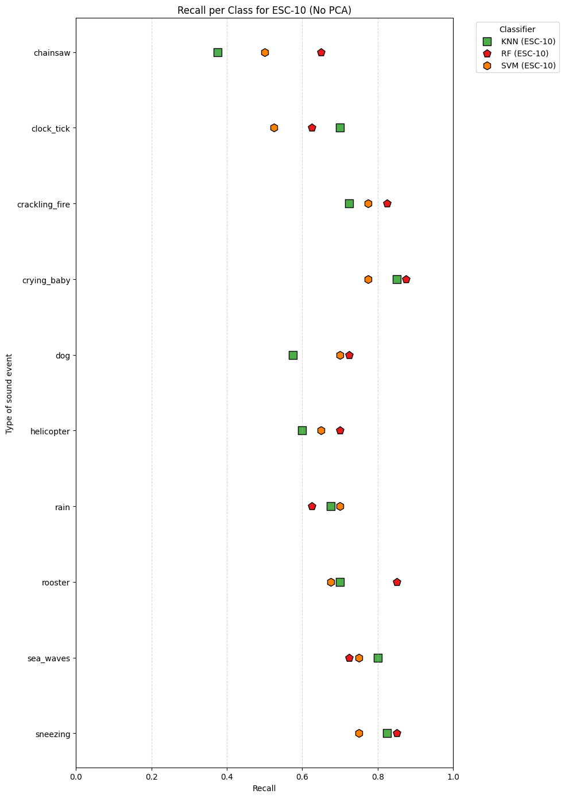
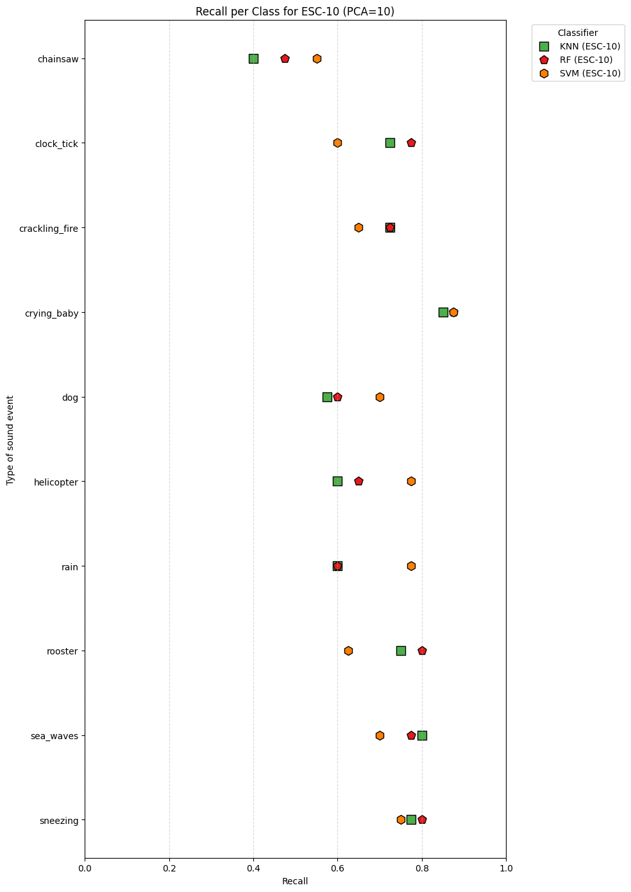
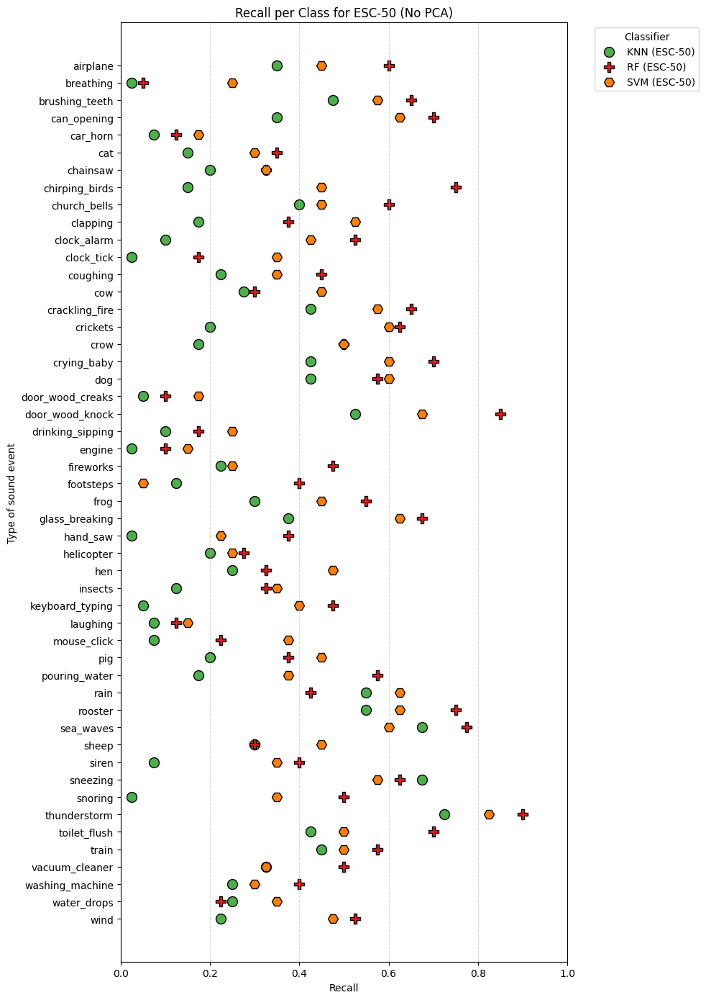
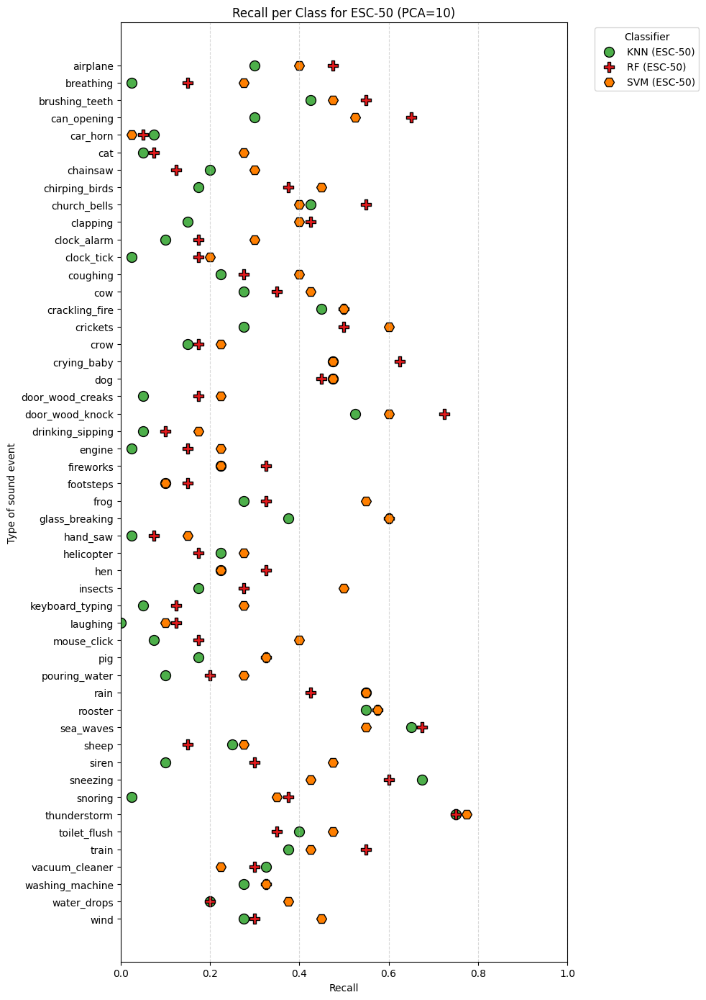
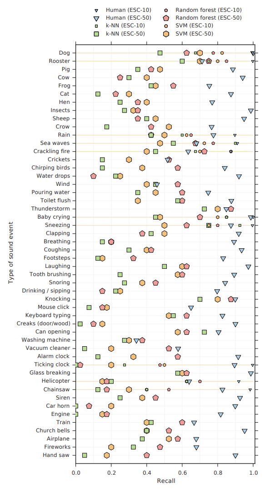

# Audio processing project

ESC: Dataset for Environmental Sound Classification (Piczak, 2015) – This paper introduces the ESC-50 dataset (2,000 five-second recordings, 50 balanced classes of environmental sounds). Paper available at [Website](https://www.karolpiczak.com/papers/Piczak2015-ESC-Dataset.pdf)

Paper is reproducible. To see my results check `environmental_sound_classification.ipynb`.

### Exploratory data analysis
The ESC-10(left image) dataset displays strong consistency within each class and clear separability between different classes. Most sounds can be grouped into broader categories such as transient or percussive events (like sneezing, dog barking, or a ticking clock), sounds with rich harmonic content (such as a baby crying or a rooster crowing), and more continuous, noisy soundscapes (like rain, ocean waves, or helicopter noise). The main classification challenges are likely to arise within these groups, for example, distinguishing between similar ambient sounds like rain and sea waves.

The ESC-50 dataset(right image), with its larger number of categories, presents a greater challenge—particularly due to the increased likelihood of ambiguous recordings and the presence of background noise, which can make some sounds harder to distinguish.

    
    

### Experimental setup
All models were evaluated using stratified 5-fold cross-validation to ensure balanced class distribution. Also I did model ensembling using `SVM`, `knn`, `Random Forest`. I use `PCA` as well to reduce number of components. It was all implemented using scikit-learn and librosa. 

### Feature extraction

In this project, I used a custom FeatureExtractor to generate fixed-size audio features based on MFCCs and Zero-Crossing Rate (ZCR). For each audio clip, the first 13 MFCCs were computed and summarized using their mean and standard deviation across time, yielding 26 features. ZCR was similarly summarized with its mean and standard deviation, adding 2 more features. This results in a compact 28-dimensional feature vector per audio file, capturing both spectral and temporal sound characteristics for use with classical classifiers.

### Results compared to original paper

My classification results (average accuracy across 5 Folds)

| Dataset   | PCA     | Classifier | Avg Accuracy |
|-----------|---------|------------|--------------|
| ESC-10    | No      | KNN        | 68.2%        |
| ESC-10    | No      | Random Forest | 74.5%     |
| ESC-10    | No      | SVM        | 68.0%        |
| ESC-10    | PCA=10  | KNN        | 68.0%        |
| ESC-10    | PCA=10  | Random Forest | 70.7%     |
| ESC-10    | PCA=10  | SVM        | 70.0%        |
| ESC-50    | No      | KNN        | 26.1%        |
| ESC-50    | No      | Random Forest | 46.0%     |
| ESC-50    | No      | SVM        | 42.2%        |
| ESC-50    | PCA=10  | KNN        | 25.3%        |
| ESC-50    | PCA=10  | Random Forest | 33.8%     |
| ESC-50    | PCA=10  | SVM        | 37.2%        |

Comparison of classification accuracy between folds depending on the choice of classifier. Results withing single dataset scope differ, however generally, in the scope of all datasets, the result are almost identical.

    
    

Karol Piczak also provides baseline results using traditional machine learning models. He computes MFCC features and evaluates classifiers such as k-NN, SVM, and Random Forest using 5-fold cross-validation. On the ESC-10 dataset, the average classification accuracy ranges from 66.7% for k-NN to 72.7% for the Random Forest ensemble, with SVM achieving 67.5%. The ESC-50 dataset shows less variability across folds but highlights a clearer advantage for Random Forest (44.3%) over SVM (39.6%) and k-NN (32.2%)

Here is also comparison to my recall class and the that is present on paper

Paper recall class

It is visible that my results are similar to the results from original paper.

### Conclusion

This paper explores classical machine learning methods for environmental sound classification using the ESC datasets. By analyzing traditional models like k-NN, SVM, and Random Forest, it aims to establish strong baselines and better understand their performance on these publicly available audio benchmarks. This work contributes to the broader research effort by highlighting the value of simple, interpretable models in a field increasingly dominated by deep learning(Yes thats true I have no free gpu left :) ).